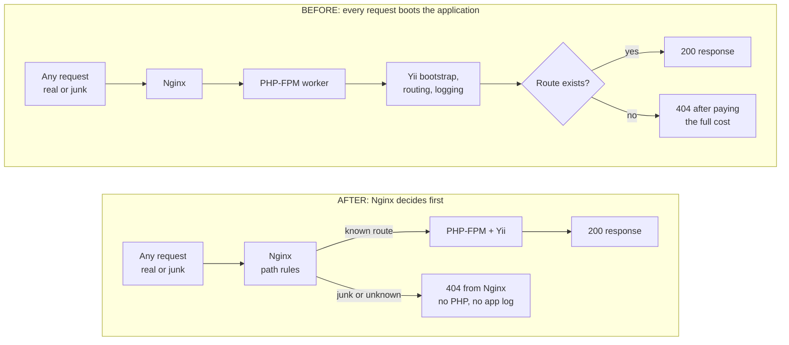
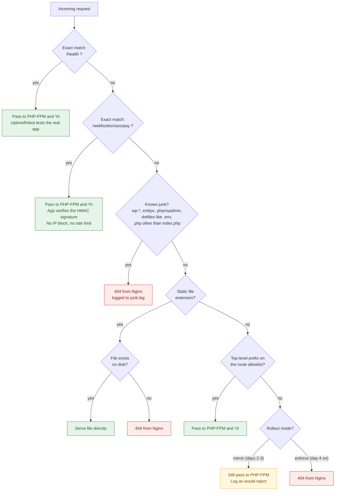
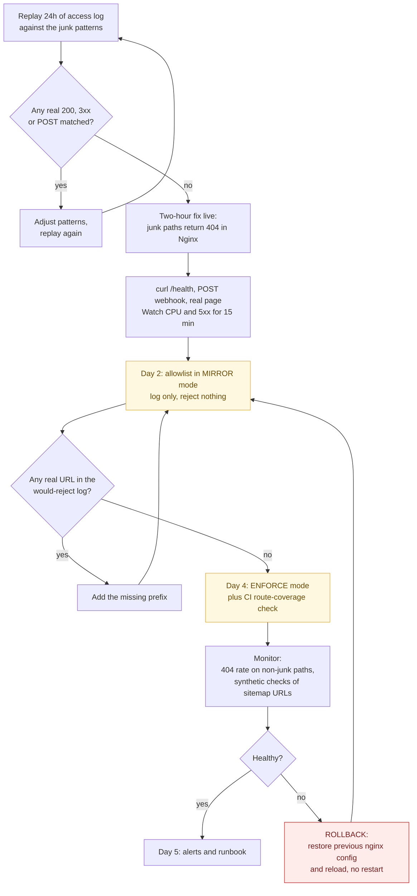

# Assignment 2: Architecture Diagrams

These diagrams support `PROPOSAL.md`. They are written in Mermaid, which GitHub renders automatically when you open this file in the repository.

---

## Diagram 1: Request flow before and after

Today every request, including junk, pays the full cost of booting Yii. In the proposal, junk is answered by Nginx and never reaches PHP.

---

## Diagram 2: How Nginx classifies each request

This is the decision the proposal adds. The two protected routes are matched first, by exact match, so no later rule can affect them.

---

## Diagram 3: Rollout plan and rollback

The allowlist is the riskiest change, so it goes live in stages. It only starts rejecting after a day of log-only observation.

---

## Summary of what each diagram shows

| Diagram | Question it answers |
|---|---|
| 1. Before and after | Where does the CPU and memory saving come from? |
| 2. Nginx classification | How are `/health` and the webhook guaranteed to stay safe? |
| 3. Rollout and rollback | How do we avoid the allowlist causing a new outage? |
